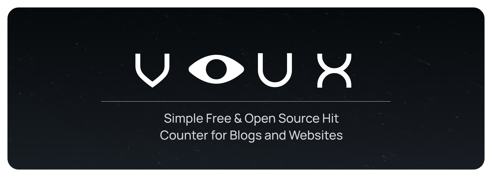

<h1 id="start-of-content" align="center">
  <a id="start-of-content" href="http://voux.fr0st.xyz" target="_blank"></a>
</h1>
<p align="center"><strong>Simple Free & Open Source Hit Counter for Blogs and Websites</strong></p>


<p align="center">
<a href="#-features">⭐ Features</a> •
<a href="#-self-hosting">🏡 Self Hosting</a> •
<!--<a href="#-configuration">Configuration</a> •-->
<!--<a href="#-api-quick-reference">API quick reference</a> •-->
<a href="#customization">🖌️ Customization</a> • 
<a href="#-public-instances">🌍 Public Instances</a> •
<a href="https://voux-docs.vercel.app/">📘 Documentation</a>  
<!--<a href="#-styling-embeds">Styling embeds</a> •
<a href="#-clearing-saved-ips">Clearing saved IPs</a>--->
</p>

## ⭐ Features

- **Simple embeds**: Generate counters easily and embed them with one `<script>` tag or as **SVGs**.
- **Self hosted**: Your data stays on your own server. No third party tracking, no relying on someone else's service.
- **Full data ownership**: Export your whole database or selected counters as `JSON` anytime.
- **Clean control panel**: Fast dashboard with **search**, **filters**, **quick edits**, **notes**, and **live stats**.
- **Today, 7 day, 30 day stats**: Clear activity views so you always know what is actually being used.
- **Users, roles and API**: Add **users**, turn permissions **on** or **off**, and use the **API** if you need it.
- **Public or Private**: Keep it public or restrict it completely.
- **Abuse protection**: Optional per IP limit throttle for every-visit based counters.
- **Lightweight**: Minimal setup, low resource usage, runs fine on small servers.
- *And much more...!*

So yeah... it's pretty good `:)`

## 🏡 Self Hosting

### `📦 Manual installation`

### 1. Clone the project

First, download Voux and enter the project folder:
```bash
git clone https://github.com/QuintixLabs/Voux.git
cd Voux
```

Make sure you are running `Node.js 22`. If you use [fnm](https://github.com/Schniz/fnm) :

```bash
fnm install 22
fnm use 22
node -v
```

### 2. Install Voux
Use one of these:

```bash
npm install                # normal install
npm install --production   # for production installs
```

### 3. Create your .env file

```bash
cp .env.example .env
```
> [!IMPORTANT]
> - Open `.env` and set your settings.
> This is where you configure your **admin login**, **site URL**, **port**, and **other options**.
> You must set `ADMIN_USERNAME` + `ADMIN_PASSWORD` before running the server.
> - If you run **Voux** on a public domain, set `PUBLIC_BASE_URL` to your full URL (for example, [https://your-domain.com](https://your-domain.com)) <!-- so embeds and previews use the correct **HTTPS** address. -->
> - If **Voux** is behind a **reverse proxy** or **tunnel** (for example `Nginx`, `Caddy`, `Cloudflare Tunnel`, etc.), also set: `TRUST_PROXY=1`

For more settings check [Documentation](https://voux-docs.vercel.app/docs/configuration/environment-variables)

### 4. Start Voux
**Development (auto-reload) :**
```bash
npm run dev
```

**Production:**
```bash
npm start
```

By default, both commands run at: [http://localhost:8787](http://localhost:8787). You can change this by setting the **PORT** value in `.env`.

During development, set `NODE_ENV=development` in your `.env` to serve HTML/JS/CSS with `no-store` caching.

#

### `🐋 Docker`

Run Voux via Docker:

```bash
docker run -d \
  --name voux \
  -p 8787:8787 \
  -e ADMIN_USERNAME=admin \
  -e ADMIN_PASSWORD=change-this-password \
  # -e PUBLIC_BASE_URL=https://your-domain.com \
  # -e TRUST_PROXY=1 \
  -v $(pwd)/data:/app/data \
  ghcr.io/quintixlabs/voux/voux:latest
```

Or use our [docker-compose.yml](https://github.com/QuintixLabs/Voux/blob/master/docker-compose.yml), which is simpler. Just run:

```bash
docker compose up -d
```

> [!IMPORTANT]
> - Change `ADMIN_USERNAME` + `ADMIN_PASSWORD` to your own login (do not leave it as the example).
> - If deploying on a public domain, set `PUBLIC_BASE_URL` to your full site URL (for example, <a href="https://your-domain.com" target="_blank">https://your-domain.com</a>).
> - If **Voux** is behind a **reverse proxy** or **tunnel** (for example `Nginx`, `Caddy`, `Cloudflare Tunnel`, etc.), also set: `TRUST_PROXY=1`

For more settings check [Documentation](https://voux-docs.vercel.app/docs/configuration/environment-variables)

<!-- <p>Need more details or advanced setup options? <a href="https://voux-docs.vercel.app/docs/getting-started/installation/docker" target="_blank">Read the documentation</a>.</p> -->

<!---
## 🔧 Configuration

Environment variables. You can tweak some of these options later from `/settings` without editing `.env`.


| Name | Default | What it does |
| ---- | -------- | ------------ |
| `PORT` | `8787` | The web server port number. |
| `PUBLIC_BASE_URL` | based on request | Lets you set a fixed site URL (like `https://counter.yourdomain.com`). |
| `ADMIN_USERNAME` | `unset` | Username for the first admin account. |
| `ADMIN_PASSWORD` | `unset` | Password for the first admin account. |
| `PRIVATE_MODE` | `false` | If `true`, only admins can create new counters. |
| `ADMIN_PAGE_SIZE` | `5` | How many counters show on each page in the admin panel. |
| `USERS_PAGE_SIZE` | `4` | How many users show on each page in the users list. |
| `SHOW_PUBLIC_GUIDES` | `true` | Controls if public guide cards are shown on the main page. |
| `DEFAULT_ALLOWED_MODES` | `unique,unlimited` | Comma-separated list of modes to allow (`unique`, `unlimited`) for counters. You can change it later in the dashboard. |
| `COUNTER_CREATE_LIMIT` | `5` | How many counters a single IP can create before hitting the one-minute cooldown. |
| `COUNTER_CREATE_WINDOW_MS` | `60000` | Window length (in ms) for the above limit. Leave it alone unless you need a different window. |
| `INACTIVE_DAYS_THRESHOLD` | `14` | Days with no hits before a counter shows an "Inactive" badge in the dashboard. |
| `BRAND_NAME` | `Voux` | Default display name (used in titles, hero text). You can override it in `/settings`. |
| `HOME_TITLE` | `Voux · Simple Free & Open Source Hit Counter...` | The homepage `<title>` tag value. Editable in settings. |
| `UNLIMITED_THROTTLE_SECONDS` | `0` | Seconds to wait before counting the same IP again in "Every visit" mode. `0` disables throttling. Applies only on first boot, once `data/config.json` exists, update the throttle from `/settings` or edit that file (`config.json`) (deleting it will regenerate from `.env`). |
| `DEV_MODE` | `development` | Use `development` in `.env` to serve HTML/JS/CSS with `no-store` caching. |

SQLite lives in `data/counters.db`. Back it up occasionally if you care about the numbers (or download a JSON backup from `/settings`, which now includes the 30-day activity summaries and your tag catalog). If you delete the DB file, **Voux** creates a fresh empty one on the next start, but all counters are wiped unless you restore from a backup.
--->

<!---
## 🧩 API quick reference

- `GET /api/config` – tells the UI what's enabled: `{ privateMode, showGuides, allowedModes, defaultMode, adminPageSize }`.
- `POST /api/login` – log in with `{ "username": "...", "password": "..." }`.
- `GET /api/session` – returns the logged-in user (if any).
- `POST /api/logout` – clear the current session.
- `POST /api/counters` – create a counter (admin login required when private mode is on). Body at minimum: `{ "label": "Views:", "startValue": 0, "mode": "unique" }`. Add `"tags": ["tag_id_here"]` to auto-assign colored tags.
- `GET /api/counters?page=1&pageSize=20&mode=unique&tags=tagA&tags=tagB&sort=views` – paginated list of counters (requires login). Filter by counting mode and/or by one or more tag IDs.
- `GET /api/counters/:id` – fetch a single counter plus its embed snippet (public; notes are omitted).
- `GET /embed/:id.js` – the script you drop into your site.
- `DELETE /api/counters/:id` – delete a single counter (requires login).
- `DELETE /api/counters?mode=unique` – delete every counter that uses the given mode (admin only). Omit `mode` to delete everything.
- `PATCH /api/counters/:id` – edit a counter's label, value, note, or tags (requires login).
- `POST /api/counters/:id/value` – set a counter's value directly (requires login).
- `GET /api/settings` – fetch the current runtime config (admin only).
- `POST /api/settings` – update runtime flags (private mode, guide cards, allowed modes, etc.).
- `GET /api/counters/export` – download every counter plus its 30-day activity summary and the tag catalog as JSON (admin only).
- `POST /api/counters/import` – restore counters (and optional activity data/tag catalog) from a JSON backup (admin only).
- `POST /api/counters/export-selected` – body `{ "ids": ["abc123", "def456"] }` returns just those counters plus their daily stats (admin only). Includes the current tag catalog so you can restore the colors elsewhere.
- `POST /api/counters/bulk-delete` – body `{ "ids": [...] }` removes the specified counters (admin only).
- `GET /api/api-keys` – list owner API keys (admin only).
- `POST /api/api-keys` – create a new key (admin only).
- `DELETE /api/api-keys/:id` – revoke a key (admin only).
- `POST /api/counters/purge-inactive` – delete counters that haven't seen hits in X days (admin only).
- `GET /api/tags` – list tag definitions (admin only). Used by the dashboard to render the tag pickers.
- `POST /api/tags` – create a new tag with `{ "name": "Articles", "color": "#ff8800" }` (admin only).

Every admin request needs the `X-Voux-Admin: <token>` header. For day-to-day management, just visit `/dashboard`, sign in once, and use the dashboard (it already calls these endpoints under the hood). Owner API keys use the `X-Voux-Key: <token>` header and can only touch the counters you assign to them.
--->

<h2 id="customization"> 🎨 Styling script embeds </h2>

Styling your counter with **Voux** is super simple. All you need to do is wrap your counter script inside an element. We'll use a `<span>` in this example:

```html
<span class="counter-widget">
  <!---------------------replace this with urs--------------------->
  <script async src="https://your-domain/embed/abc123.js"></script>
</span>
```

Once that's in place, you can style it however you like using **CSS**. Here's a simple example that centers the counter on the screen and makes the text black:

```css
.counter-widget {
  position: fixed;
  top: 50%;
  left: 50%;
  transform: translate(-50%, -50%);
  text-align: center;
  color: black;
  font-weight: 600;
  font-size: 3rem;
  font-family: system-ui, sans-serif;
}
```
And that's it. Your counter is now styled and ready to use. You can change the font, colors, or layout any way you like.

## 🧩 Styling SVGs embeds

Voux also provides an **SVG embed** for cases where you cannot use **JavaScript**, such as **READMEs**, **Markdown files**, or **restricted platforms**.

```html

```

You can also customize the **SVG** by passing **parameters** in the `URL` query string:

```html

```
See the [documentation](https://voux-docs.vercel.app/docs/basics/counters#styling-svgs-embeds) for a full list of **SVG** parameters. 


## 👀 SVG counters on GitHub

GitHub READMEs do not allow **JavaScript**, so **SVGs** are the only option.

| Mode | Info | Example |
| ---- | ---- | ------- |
| 👤 Unique visitors | Not available on GitHub (images are cached and proxied, so Voux cannot use its IP-based method) | ❌ |
| 🔁 Every visit | Works on refresh (try it now just refresh the page) |  |

And on **documentation websites**, Unique Visitors work, check it out [here](https://voux-docs.vercel.app/docs/basics/counters#svgs-in-documentation)!


<!---
## 🧹 Clearing saved IPs

Voux keeps a simple list of "which IP hit which counter, and when" so it can avoid double-counting unique visitors. To wipe that list (for privacy or to give everyone a fresh start), run:

```bash
npm run clear-hits
```

This keeps your counters and their values. It only clears the saved IP/timestamp pairs so future visits count again.
--->

## 🌐 Public instances

If you want to run your own public **Voux instance** and add it to the official [public instances list](https://github.com/QuintixLabs/voux-instances-uptime), you can submit it [here](https://github.com/QuintixLabs/Voux/issues/new?template=1_add_instance.yml).


## 📄 License
[](http://www.gnu.org/licenses/gpl-3.0.en.html)

Voux is [Free Software](https://en.wikipedia.org/wiki/Free_software): You can use, study, share and modify it at your will. The app can be redistributed and/or modified under the terms of the
[GNU General Public License version 3](https://www.gnu.org/licenses/gpl.html) published by the 
[Free Software Foundation](https://www.fsf.org/).

<div align="right">
<table><td>
<a href="#start-of-content">↥ Scroll to top</a>
</td></table>
</div>

